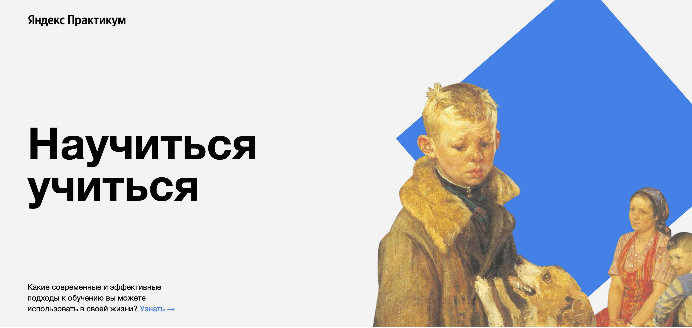

# How to learn.
___

## A single-page website is created using HTML and CSS

### Stack
* HTML
* CSS

### Realization
* Flexbox layout
* CSS-animation
* The Nested BEM methodology

### URL
* https://jesuisartorius.github.io/how-to-learn/